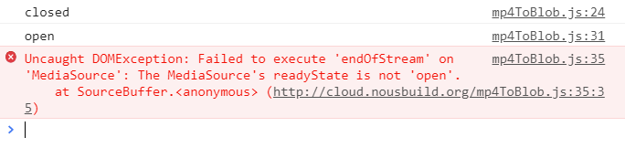
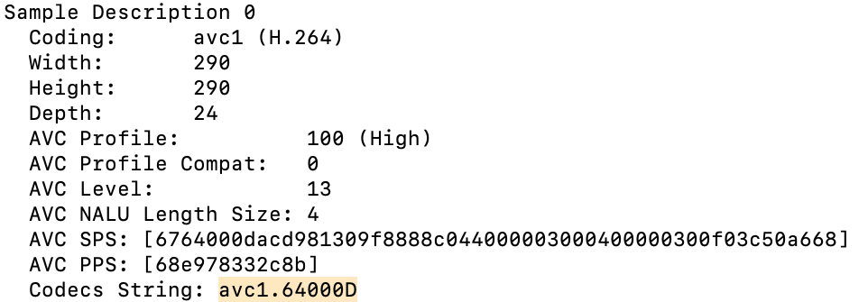
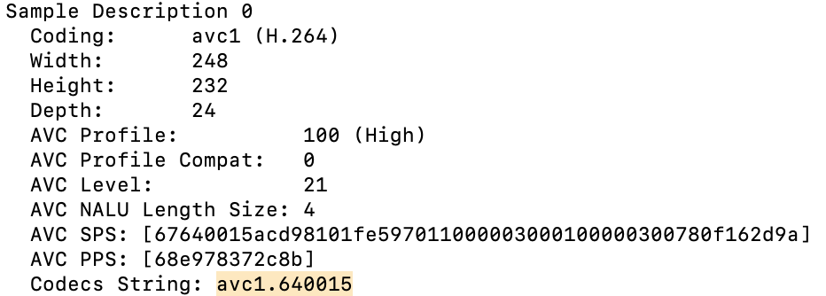

# mp4ToBlob.js
**mp4ToBlob.js** 是一个可以在前端将你的 mp4 格式视频以 `blob src` 的形式展现出来的脚本。

### 1. 如何使用？

#### 1.1 引入 JS

在 `<header>` 引入 mp4ToBlob.js：

```html
<script type="text/javascript" src="js/mp4ToBlob.js"></script>
```

#### 1.2 配置信息

添加配置信息到 JavaScript 中：

```javascript
var url = 'siri-white.mp4'; // 视频url

var mimeCodec = 'video/mp4; codecs="avc1.640028"'; // 根据视频信息原样填写

Mp4ToBlob.init('#video', url, mimeCodec, true); // #video是选择器id，true 是 autoplay 开启
```

#### 1.3 定义容器

在需要使用视频的位置，使用 `<video>` 标签并标明 `id  ` 即可：

```html
<video id="video"></video>
```

### 2. 遇到错误

#### 2.1 错误一

如果遇到了以下错误：

> Failed to execute 'endOfStream' on 'MediaSource': The MediaSource's readyState is not 'open'.



说明使用的 MP4 视频并不是 `fragmented` 的，需要使用 **Bento4** 工具进行转换。

##### 下载 Bento4：[https://www.bento4.com/downloads/](https://www.bento4.com/downloads/)

##### 使用 Bento4

需要注意的事情是，windows上的bin目录下的 exe 是需要通过命令行来运行。

1. 解压缩
2. 打开 bin 目录
3. 在 bin 目录上开启 Powershell 或者 Cmd
4. 运行如下命令：

```powershell
.\mp4fragment.exe source.mp4 new.mp4
```

其中：`mp4fragment.exe` 是命令 ， `source.mp4` 是原视频地址 ， `new.mp4` 是要输出的视频路径。

#### 2.2 错误二

> MP4 视频已经是 `fragmented` 的，但是仍提示错误。

说明你的 `mimeCodec` 参数没有填写正确，使用 Bento4 获取视频编码信息：

```powershell
.\mp4info.exe this.mp4
```

其中：`mp4info.exe` 是命令 ， `this.mp4` 是此视频。





### 3.例子

在 `/demo` 下有一个样例，需要注意的是必须要在服务器上才能表现出来，你需要搭建本地服务器或者上传至网络服务器。

还可以直接点击此链接进行在线预览：

+ [Siri Blob 白色演示页面](https://pudding0503.github.io/mp4ToBlob/demo/siri-white-blob.html)

+ [Siri Blob 黑色演示页面](https://pudding0503.github.io/mp4ToBlob/demo/siri-black-blob.html)

### 4. 许可

[MIT License](https://github.com/pudding0503/mp4ToBlob/blob/master/LICENSE)
